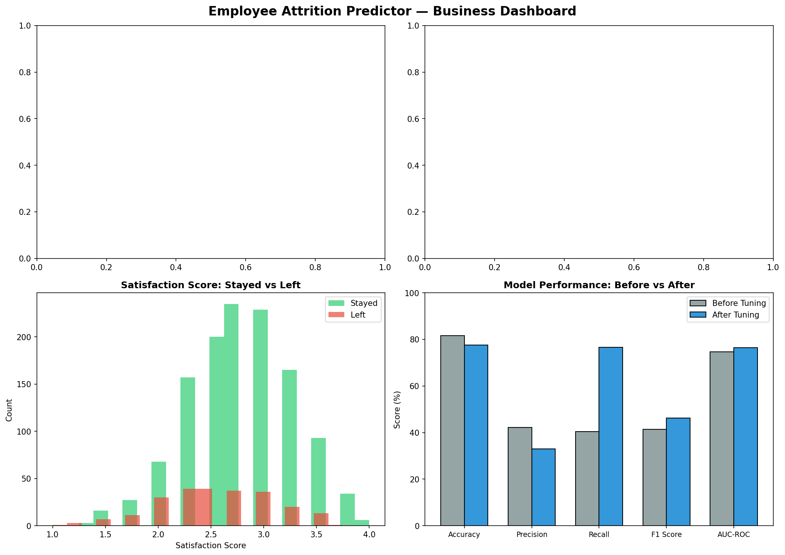
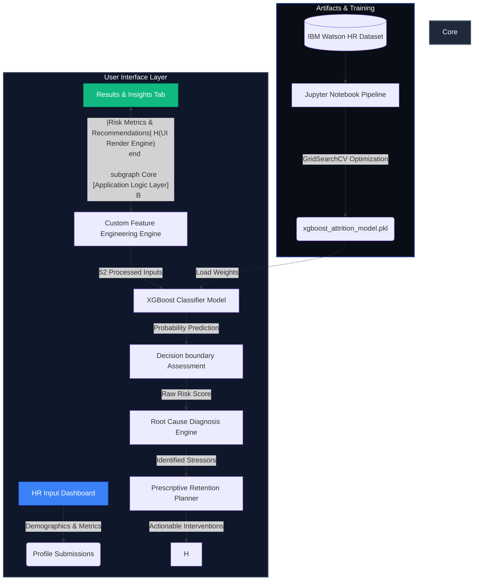
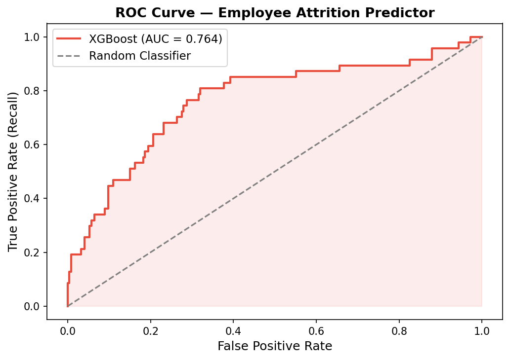
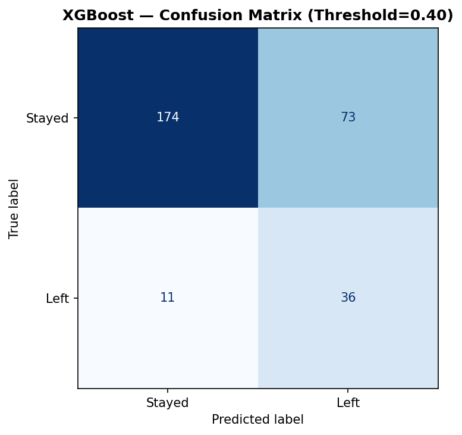
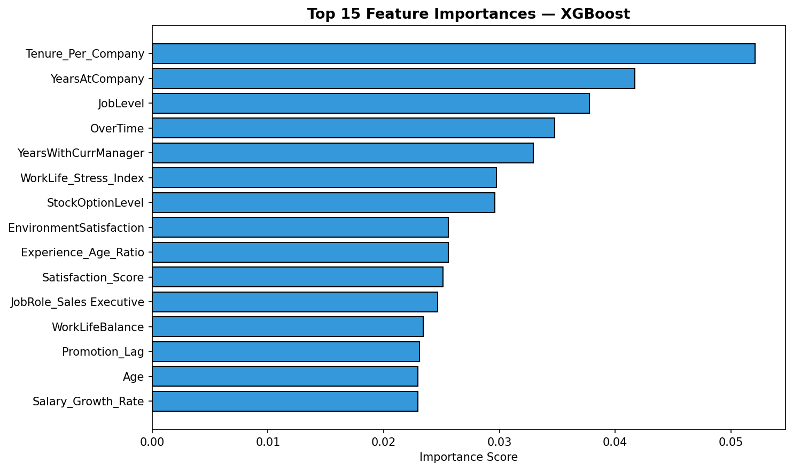
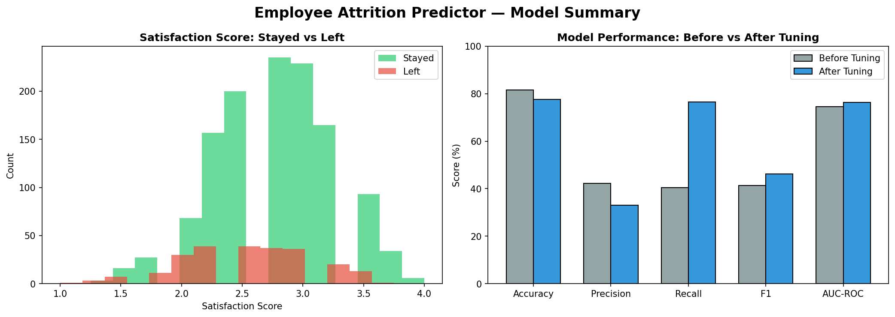

# 🎯 HR Attrition Intelligence System

An advanced AI-powered decision support system designed to assist Human Resources professionals in proactively identifying, analyzing, and managing employee turnover risks. Built with **Streamlit** and powered by a fine-tuned **XGBoost Classifier** on the IBM Watson HR Analytics dataset.

---

<!-- <p align="center">
  
</p> -->

<p align="center">
  <a href="https://github.com/Isha-Maryam/HR_Attrition_Intelligence_System"></a>
  <a href="https://streamlit.io/"></a>
  <a href="https://xgboost.ai/"></a>
  
  
  
</p>

<!-- --- -->
<!-- 
## 📌 Table of Contents
- [📊 Business Challenge & Objective](#-business-challenge--objective)
- [⚙️ System Architecture](#️-system-architecture)
- [🚀 Key Features](#-key-features)
- [🧪 Machine Learning Pipeline & Performance](#-machine-learning-pipeline--performance)
- [🧠 Advanced Feature Engineering](#-advanced-feature-engineering)
- [📁 Project Directory Structure](#-project-directory-structure)
- [💻 Installation & Local Setup](#-installation--local-setup)
- [🌐 Hugging Face Spaces Deployment](#-hugging-face-spaces-deployment)
- [👩‍💻 Developer Profile](#-developer-profile)
- [📜 License](#-license) -->

<!-- --- -->

## 📊 Business Challenge & Objective

Employee attrition represents a significant financial and operational drain on modern enterprises. Replacing highly skilled personnel frequently costs **50% to 200% of the employee's annual salary** in recruitment fees, onboarding time, lost productivity, and team disruption.

**The Solution:** The **HR Attrition Intelligence System** moves HR teams from reactive exit interviewing to **proactive risk mitigation**. By feeding detailed employee metrics (demographics, job roles, satisfaction levels, compensation, work environments, and work history) into our machine learning model, HR managers receive:
1. A highly accurate, probabilistic attrition risk estimate.
2. Direct identification of the key risk drivers (e.g., severe overtime fatigue, lack of career progression).
3. Immediate prescriptive retention recommendations with estimated retention score boosts.

---

## ⚙️ System Architecture

The following diagram illustrates how the system processes data, engineers features, conducts inference, and serves recommendations to the HR stakeholder:



---

## 🚀 Key Features

*   ** Employee Risk Estimation:** Evaluates attrition probability using a fine-tuned XGBoost model tuned via GridSearchCV. Displays results inside an animated, color-coded interactive radial gauge chart.
*   ** Root Cause Diagnosis:** Dynamically extracts the specific personal and career factors contributing to an employee's high risk score (e.g., promotion lags, low job involvement, extreme work-life stress).
*   ** Prescriptive Action Plans:** Generates bespoke intervention strategies mapped directly to the active root causes, calculating a projected **"Retention Boost"** metric should actions be executed.
*   ** Premium Dark UI:** Features a high-fidelity, customized CSS dark mode configuration equipped with fade-ins, stagger animations, and pulsing micro-interactions for a premium software experience.
*   ** Comprehensive Analytical Dashboards:** Out-of-the-box analytical plots demonstrating overall performance, correlation heatmaps, feature importance, and general model evaluations.

---

##  Machine Learning Pipeline & Performance

The classifier is built on top of an optimized **XGBoost Classifier** model pipeline. Optimization was performed via rigorous hyperparameter searching (`GridSearchCV`) to maximize structural sensitivity (`Recall`) without incurring excessive false alarms.

### Model Hyperparameters
```json
{
    "colsample_bytree": 0.8,
    "learning_rate": 0.01,
    "max_depth": 3,
    "n_estimators": 300,
    "subsample": 0.8
}
```

### Performance Metrics
*   **AUC-ROC Score:** `76.44%` — demonstrates high model discriminative capacity.
*   **Recall:** `76.60%` — ensures 3 out of 4 high-risk employees are correctly identified before departing.
*   **Precision:** `33.03%` — balanced to maximize candidate capture in a high-imbalance dataset.
*   **Optimal Decision Threshold:** `0.40` — calibrated mathematically to balance cost-effective interventions.

### Model Evaluation Visualizations

To review the detailed model metrics, consult the pre-compiled evaluation plots:

| 📈 ROC Curve | 📊 Confusion Matrix |
| :---: | :---: |
|  |  |
| **🏆 Feature Importance** | **📝 Model Evaluation Summary** |
|  |  |

---

## 🧠 Advanced Feature Engineering

A key driver of our XGBoost model's performance is the creation of specialized, high-yield domain features that reveal hidden behavioral signals. 

| Engineered Feature | Mathematical Formulation / Logic | Target Signal Captured |
| :--- | :--- | :--- |
| **Satisfaction Score** | $\frac{\text{JobSat} + \text{EnvSat} + \text{RelSat} + \text{WorkLifeBalance}}{4}$ | Holistic employee happiness across all operational dimensions. |
| **Promotion Lag** | $\text{YearsAtCompany} - \text{YearsSinceLastPromotion}$ | Career stagnation. Measures how long an employee has worked without growth. |
| **Tenure Per Company** | $\frac{\text{TotalWorkingYears}}{\text{NumCompaniesWorked} + 1}$ | Job-hopping frequency vs. career stability. |
| **WorkLife Stress Index** | $\text{Overtime (0/1)} \times (5 - \text{WorkLifeBalance})$ | Burnout risk indicator resulting from heavy overtime coupled with poor balance. |
| **Salary Growth Rate** | $\frac{\text{PercentSalaryHike}}{\text{YearsAtCompany} + 1}$ | Financial recognition velocity compared to organizational tenure. |
| **Manager Relationship Risk** | $(5 - \text{RelationshipSatisfaction}) \times \frac{1}{\text{YearsWithCurrManager} + 1}$ | Captures early friction with a new manager or prolonged friction with an existing one. |
| **Experience Age Ratio** | $\frac{\text{TotalWorkingYears}}{\text{Age}}$ | Career intensity and lifetime work density. |

---

## 📁 Project Directory Structure

```directory
HR_Attrition_Intelligence_System/
│
├── Dataset/                                 # Raw data directory
│   └── WA_Fn-UseC_-HR-Employee-Attrition.csv # IBM HR Attrition dataset (CSV)
│
├── NoteBooks/                               # Model development workspace
│   └── employee-attrition-predictor.ipynb    # Jupyter Notebook containing EDA & ML training
│
├── app/                                     # Streamlit application source
│   ├── .streamlit/                          # App configurations
│   ├── models/                              # Pretrained model replicas for app deployment
│   │   ├── xgboost_attrition_model.pkl
│   │   └── model_config.json
│   ├── plots/                               # Graphical assets for Hugging Face rendering
│   ├── app.py                               # Core Streamlit app (Dark UI, Custom CSS, Rec Engine)
│   ├── README.md                            # HF Space setup file (preserves Space metadata)
│   └── requirements.txt                     # Core dependencies for cloud deployment
│
├── models/                                  # Central model registry
│   ├── xgboost_attrition_model.pkl          # Trained serialized XGBoost weight binary
│   └── model_config.json                    # Hyperparameter metadata & metrics config JSON
│
└── plots/                                   # Analysis, Model evaluation & EDA plots
    ├── EDA_Visuals/                         # Visual insights from EDA stage (6 plots)
    ├── business_dashboard.png               # High-level corporate risk report preview
    ├── confusion_matrix.png                 # Test evaluation confusion matrix
    ├── feature_importance.png               # Engineered feature importance chart
    ├── model_summary.png                    # Aggregated ROC, PR & Metrics report
    └── roc_curve.png                        # Model Receiver Operating Characteristic curve
```

---

## 💻 Installation & Local Setup

Get the HR Attrition Intelligence System running locally in just three steps:

### 1. Clone the Repository
```bash
git clone https://github.com/Isha-Maryam/HR_Attrition_Intelligence_System.git
cd HR_Attrition_Intelligence_System
```

### 2. Install Dependencies
Ensure you have Python 3.9+ installed, then install required modules:
```bash
pip install -r app/requirements.txt
```

### 3. Run the Streamlit Application
Start the local server. The app should automatically launch in your default web browser at `http://localhost:8501`.
```bash
streamlit run app/app.py
```

---

## 🌐 Hugging Face Spaces Deployment

The system is fully compatible with Hugging Face Spaces using the **Streamlit** SDK. 

To deploy your own copy:
1. Create a new Space on [Hugging Face](https://huggingface.co/spaces) and select **Streamlit** as the SDK.
2. Push the files located within the `app/` directory (including `app.py`, `requirements.txt`, `models/`, `plots/`, and `README.md`) directly to the root of your Hugging Face Space repository.
3. The Space will build and deploy automatically using the pre-configured Hugging Face metadata present in `app/README.md`.

---

## 👩‍💻 Developer Profile

<table align="center" style="border: none;">
  <tr>
    <!-- <td align="center" width="150">
    </td> -->
    <td>
      <h3>Isha Maryam</h3>
      <p><b>BS Computer Science(Final Year)</b> — Gomal University</p>
      <p><i>ML/DL Engineer</i></p>
      <p>
        <a href="https://github.com/"></a>
        <a href="https://linkedin.com/"></a>
        <a href="https://kaggle.com/"></a>
      </p>
    </td>
  </tr>
</table>

---

## 📜 License

This project is licensed under the **MIT License** — see the [LICENSE](LICENSE) file for details.
